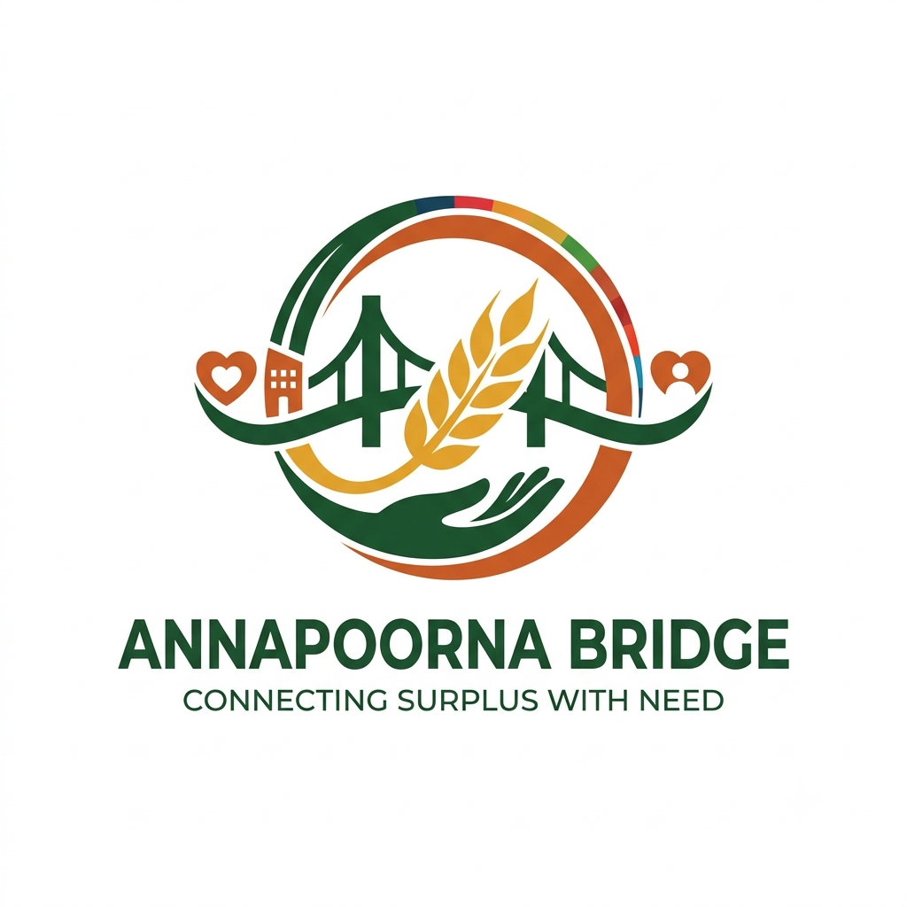

# 🌾 Annapoorna Bridge (Connecting Surplus with Need)

> **A real-time surplus food redistribution bridge connecting marriage halls, banquets, and hostels with verified food-relief NGOs in India.**
> Targeting **UN SDG 2 (Zero Hunger)** & **UN SDG 11 (Sustainable Cities & Communities)** with FSSAI-compliant food safety standards.



---

## 🎯 Mission & UN SDG Alignment

In India, massive quantities of freshly prepared food are wasted daily at weddings, convention centers, and college hostel messes, while millions struggle with food insecurity. The critical barrier is the **"Golden Window"**: hot cooked food must be redistributed safely within 4 to 6 hours before microbial proliferation.

**Annapoorna Bridge** serves as a digital lifesaver by:
1. **UN SDG 2 (Zero Hunger):** Delivering surplus nutritious meals directly to verified relief organizations, orphanages, and community shelters.
2. **UN SDG 11 (Sustainable Cities & Communities):** Diverting tonnes of organic waste from landfills, directly mitigating methane and CO₂ emissions (~2.5 kg CO₂e saved per kg food rescued).
3. **FSSAI Compliance:** Enforcing statutory food safety checklists, temperature holding zones (>60°C hot, <5°C cold), and organoleptic checks prior to dispatch.

---

## 🏗️ Architecture & Tech Stack

```
Annapoorna Bridge
├── Client (SPA Vanilla Stack)
│   ├── index.html          # Semantic HTML5 with Lucide Icons & Tailwind CSS
│   ├── css/styles.css      # Custom SDG 2 & 11 branding, thermal gauges, print slips
│   └── js/
│       ├── app.js          # Core controller, feeds, countdown intervals, modals
│       ├── auth.js         # JWT session management & fast role switching
│       ├── socket.js       # Real-time WebSockets & Web Audio synthesizer
│       ├── donor.js        # Surplus post creation, FSSAI compliance, donor tracking
│       ├── ngo.js          # Atomic race-free claims & printable dispatch slips
│       └── admin.js        # Partner verification & platform audit ledger
│
└── Server (Node.js & Express)
    ├── config/db.js        # Intelligent Mongo manager (Atlas / Local / In-Memory fallback)
    ├── models/             # Mongoose schemas (User, FoodListing, AuditLog)
    ├── controllers/        # RESTful API logic & atomic updates
    ├── routes/             # Modular express routers
    ├── middleware/         # JWT verification, RBAC & structured error handler
    ├── services/           # Socket.io broadcasting & SMS/Email simulation
    ├── seed.js             # Seed data with realistic Indian venues & NGOs
    └── server.js           # Server entrypoint with HTTP & Socket.io listeners
```

### Stack Components:
- **Frontend:** Vanilla HTML5, modern CSS3 (Tailwind CSS CDN + custom design tokens), ES6+ Vanilla JavaScript.
- **Backend:** Node.js, Express.js (RESTful API, modular controllers and middleware).
- **Database:** MongoDB with Mongoose (with automated **MongoMemoryServer** fallback for zero-config local runs!).
- **Real-Time:** Socket.io (instant alerts, room joining by city/role, live status transitions).
- **Audio Synthesizer:** Native Web Audio API chime generator (no external audio asset dependencies).
- **Security & Auth:** JWT tokens, role-based access control (RBAC), bcrypt password hashing.

---

## 👥 User Roles & Capabilities

### 1. 🏨 Food Donor (Marriage Halls, Banquets, Hostels, Caterers)
- Register with FSSAI / GST / Trade License.
- Post surplus food listings with:
  - Menu item name, category (Rice & Curry, Breads, Sweets, etc.), and Veg/Non-Veg emblem.
  - Portions (Plates/Kg), preparation timestamp, and safe consumption window.
  - Storage temperature condition (Hot insulated >60°C, Ambient, Chilled <5°C).
  - Venue address, contact phone, and loading dock instructions.
- **Mandatory FSSAI Safety Acknowledgment:** Legal confirmation of hygienic preparation and clean covered containers.
- **Dynamic Postings Dashboard:** Real-time countdown timer to expiry.
- **Volunteer Tracking:** Live view of claiming NGO, assigned volunteer name, vehicle number, and secret **Pickup Verification Code** for secure handover.

### 2. 🚚 Food-Relief NGO (Roti Banks, Community Kitchens, Shelters)
- Register with NGO Darpan ID / Trust Registration credentials.
- **Real-Time City Feed:** Filterable by operating city (Chennai, Mumbai, New Delhi, Jaipur, Bengaluru, Pune) and dietary preference.
- **Urgent Priority Flagging:** Perishable food with less than 2 hours remaining pulses with high-priority visual badges.
- **Atomic One-Click Claim Action:** Concurrency protection (`findOneAndUpdate({ _id, status: 'available' })`) prevents race conditions between multiple NGOs.
- **Instant Pickup Dispatch Slip:** Automatically generates a printable/downloadable slip containing donor venue directions, contact info, volunteer assignment, and verification pass code.
- **Transit Progression:** Update status from `claimed` ➔ `in_transit` ➔ `delivered`.

### 3. 🛡️ Platform Administrator
- Review and verify registered donors and NGOs via their statutory license IDs with 1-click.
- View platform-wide impact statistics (Total Kg Rescued, Meals Distributed, CO₂ Diverted).
- Inspect complete system-wide **Audit Trail / Transaction Ledger** tracking every creation, claim, and status transition.

---

## ⚡ Quick Start Guide

### 1. Prerequisites
- **Node.js** v18+ (tested on v24)
- **npm** v9+
- *Optional:* Local MongoDB instance (if not running, the application automatically launches an isolated in-memory MongoDB instance with zero configuration required!).

### 2. Installation
```bash
# Clone or navigate to the project directory
cd Food_Mangment_System

# Install dependencies
npm install
```

### 3. Environment Variables
Copy `.env.example` to `.env`:
```bash
cp .env.example .env
```
Default configuration:
```env
PORT=5000
NODE_ENV=development
MONGODB_URI=mongodb://127.0.0.1:27017/annapoorna_bridge
USE_IN_MEMORY_DB=auto
JWT_SECRET=annapoorna_bridge_jwt_super_secret_key_2026
JWT_EXPIRES_IN=7d
SIMULATE_NOTIFICATIONS=true
```

### 4. Run the Application
```bash
# Start server (auto-seeds sample data on first launch!)
npm start
```
Open your browser at: **`http://localhost:5000`**

---

## 🚀 Deploying to Vercel

The application is pre-configured with:
- `vercel.json` for serverless API routing & static frontend hosting.
- `api/index.js` as the serverless function handler.
- Cached database connections for cloud serverless execution.

### Step 1: Set up a Free Cloud Database (MongoDB Atlas)
Because Vercel serverless functions are stateless and ephemeral, you need a cloud-hosted MongoDB database:
1. Sign up at [mongodb.com/atlas](https://www.mongodb.com/cloud/atlas) (Free M0 Sandbox cluster).
2. Create a database user and allow access from anywhere (`0.0.0.0/0`).
3. Copy your connection string:
   `mongodb+srv://<username>:<password>@cluster0.mongodb.net/annapoorna_bridge?retryWrites=true&w=majority`

### Step 2: Deploy to Vercel

#### Method A: Via GitHub (Recommended)
1. Push this codebase to your GitHub repository.
2. Go to [vercel.com](https://vercel.com) and log in.
3. Click **"Add New..."** ➔ **"Project"** and import your GitHub repository.
4. In the **Environment Variables** section, add:
   - `MONGODB_URI` = `mongodb+srv://<username>:<password>@cluster0.mongodb.net/annapoorna_bridge`
   - `JWT_SECRET` = `any_secure_random_string`
   - `SIMULATE_NOTIFICATIONS` = `true`
5. Click **Deploy**. Vercel will build and deploy your application live!

#### Method B: Via Vercel CLI
```bash
# In the project directory, run:
npx vercel

# Follow prompts:
# - Link to existing project? No
# - Project name? annapoorna-bridge
# - Root directory? ./
# - Override build settings? No

# Set your environment variables in Vercel:
npx vercel env add MONGODB_URI
npx vercel env add JWT_SECRET

# Deploy to production:
npx vercel --prod
```

---

## 🔑 Pre-Seeded Test Credentials

For quick evaluation, use the **1-Click Quick Role Switcher** in the top navigation bar or log in with these pre-seeded accounts:

| Role | Organization / Venue | Email | Password | City |
| :--- | :--- | :--- | :--- | :--- |
| **Admin** | Annapoorna Oversight Board | `admin@annapoorna.org` | `Admin@123` | New Delhi |
| **Donor** | ITC Grand Chola Banquets | `donor@grandchola.com` | `Donor@123` | Chennai |
| **Donor** | IIT Delhi Central Mess | `donor@iitdhostel.ac.in` | `Donor@123` | New Delhi |
| **Donor** | Taj Lands End Conventions | `donor@tajmumbai.com` | `Donor@123` | Mumbai |
| **Donor (Pending)** | Silver Oak Luxury Catering | `donor@silveroak.com` | `Donor@123` | Bengaluru |
| **NGO** | Mumbai Roti Bank Trust | `ngo@rotibank.org` | `Ngo@123` | Mumbai |
| **NGO** | Feeding India Foundation | `ngo@feedingindia.org` | `Ngo@123` | New Delhi |
| **NGO** | Robin Hood Army | `ngo@robinhoodarmy.com` | `Ngo@123` | Bengaluru |
| **NGO (Pending)** | Hope Kitchen Foundation | `ngo@hopekitchen.org` | `Ngo@123` | Pune |

---

## 📡 RESTful API Reference

### Authentication (`/api/auth`)
- `POST /api/auth/register` - Register a donor or NGO partner.
- `POST /api/auth/login` - Authenticate and obtain JWT token.
- `GET /api/auth/me` - Get current authenticated user profile.

### Surplus Food Listings (`/api/listings`)
- `GET /api/listings` - List surplus food alerts (filter by `city`, `dietaryType`, `foodType`, `urgentOnly`).
- `POST /api/listings` - Create a new surplus food batch (Donor role).
- `GET /api/listings/my-listings` - Retrieve listings created by the logged-in donor.
- `GET /api/listings/my-claims` - Retrieve listings claimed by the logged-in NGO.
- `GET /api/listings/:id` - Detailed view of a listing with audit trail.
- `POST /api/listings/:id/claim` - **Atomic one-click claim** with volunteer assignment.
- `PATCH /api/listings/:id/status` - Transition status (`in_transit`, `delivered`).

### Analytics & Impact (`/api/analytics`)
- `GET /api/analytics/impact` - UN SDG 2 & SDG 11 metrics (Meals served, kg rescued, CO₂ avoided, city distribution).

### Admin Governance (`/api/admin`)
- `GET /api/admin/users` - View registered and pending partners.
- `PATCH /api/admin/users/:id/verify` - Approve or revoke verification status.
- `GET /api/admin/audit-logs` - System-wide audit trail and transaction log.

### Notifications (`/api/notifications`)
- `GET /api/notifications/recent` - View simulated SMS & Email dispatches.

---

## 🛡️ FSSAI Food Safety Compliance Guidelines

1. **The Temperature Danger Zone (5°C to 60°C):** Microorganisms multiply rapidly within this band. Hot food must be maintained above 60°C in food-grade thermal containers; chilled food must remain below 5°C.
2. **The 4-Hour Rule:** Cooked food held at ambient temperatures must be distributed and consumed within 4 hours of preparation.
3. **Prohibited Foods:** Raw seafood, cut fresh fruits beyond 2 hours, pre-dressed mayonnaise salads, and reheated leftovers are strictly barred from redistribution.
4. **Organoleptic Evaluation:** All donor kitchen managers and NGO volunteers perform sensory checks (appearance, aroma, texture) before dispatch and handover.

---

## 📜 License
Annapoorna Bridge is open-source under the ISC License. Dedicated to ending hunger and food waste across India.
